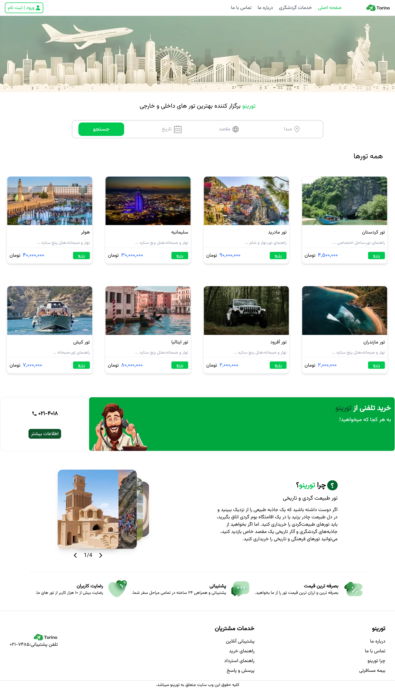
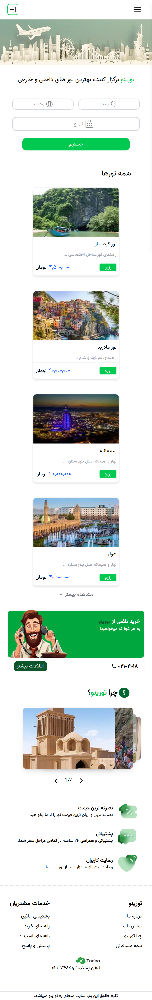

# 🌿Torino | اپلیکیشن رزرو آنلاین تور و هتل

---

## لیست محتوا

- [صفحه اصلی](#صفحه-اصلی-تورینو)

- [تکنولوژی ها](#تکنولوژی-ها)

- [روش نصب](#روش-نصب)

- [ویژگی ها](#ویژگیهای-کلیدی)

- [راه ارتباطی](#ارتباط-با-من)

---

**تورینو** یک پلتفرم مدرن و هوشمند برای رزرو تورهای داخلی و خارجی است که با هدف ارائه‌ی تجربه‌ای امن، راحت و لذت‌بخش از سفر طراحی شده است.  
در تورینو می‌توانید انواع تورهای ماجراجویانه، تفریحی و فرهنگی را مشاهده کرده، جزئیات آن‌ها را بررسی کنید و تنها با چند کلیک، سفر خود را رزرو نمایید.

تورینو با ارائه‌ی خدمات متنوعی همچون بیمه‌ی مسافرتی، رزرو هتل، راهنمای تور حرفه‌ای و پشتیبانی ۲۴ ساعته، تلاش می‌کند تا حس واقعی آرامش در سفر را برای شما به ارمغان بیاورد.

---

### 🏠 صفحه اصلی تورینو <a id="صفحه-اصلی-تورینو"></a>





---

### 💻 تکنولوژی ها <a id="تکنولوژی-ها"></a>


---

### 🔌 روش نصب <a id="روش-نصب"></a>

برای راه اندازی پروژه مانند زیر عمل کنید

1. **ریپازیتوری را clone کنید**

   ```bash
   git clone https://github.com/alireza-hedayati/final-project.git

   ```

2. **وارد فولدر my-app شوید**

`cd my-app`

3. **پکیج ها را نصب کنید**

` npm install`

4. **پروژه را اجرا کنید**

` npm run dev`

---

### 📂 ساختار پروژه

```my-app/
├── components/
│ ├── layout/
│ ├── modules/
│ └── templates/
│
├── context/
│
├── hooks/
│
├── pages/
│ ├── api/
│ ├── torino/
│ ├── _app.js
│ ├── _document.js
│ ├── 404.js
│ ├── 500.js
│ └── index.js
│
├── public/
│ ├── fonts/
│ ├── icons/
│ └── images/
│
├── styles/
│
├── utils/
├── validation/
│

```

---

### ✨ ویژگی‌های کلیدی <a id="ویژگیهای-کلیدی"></a>

- 📱 طراحی کاملا واکنش گرا و مدرن

- 🔍 جستجوی تور بر اساس تاریخ و مقصد

- ☑️ سیستم ورود با OTP و احراز هویت کاربر

- 📜 مشاهده تاریخچه تورها و تراکنش‌ها

---

### 🧾 اطلاعات توسعه‌دهنده <a id="ارتباط-با-من"></a>

👨🏻‍💻 توسعه‌دهنده: [علیرضا هدایتی](https://github.com/alireza-hedayati)

📧 ایمیل: [alireza.he80@gmail.com](alireza.he80@gmail.com)
